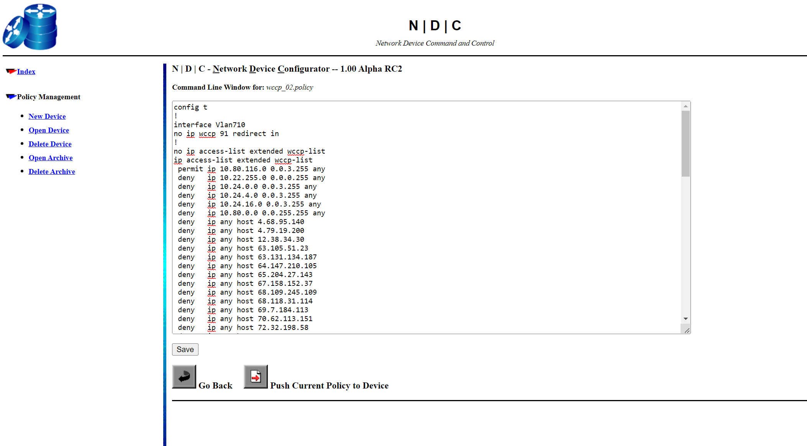

# N | D | C Network Device Configurator
Centrally manage changes to routers, switches, firewalls, load balancers, and other network devices via a simple web based command line automation tool. -- N | D | C

